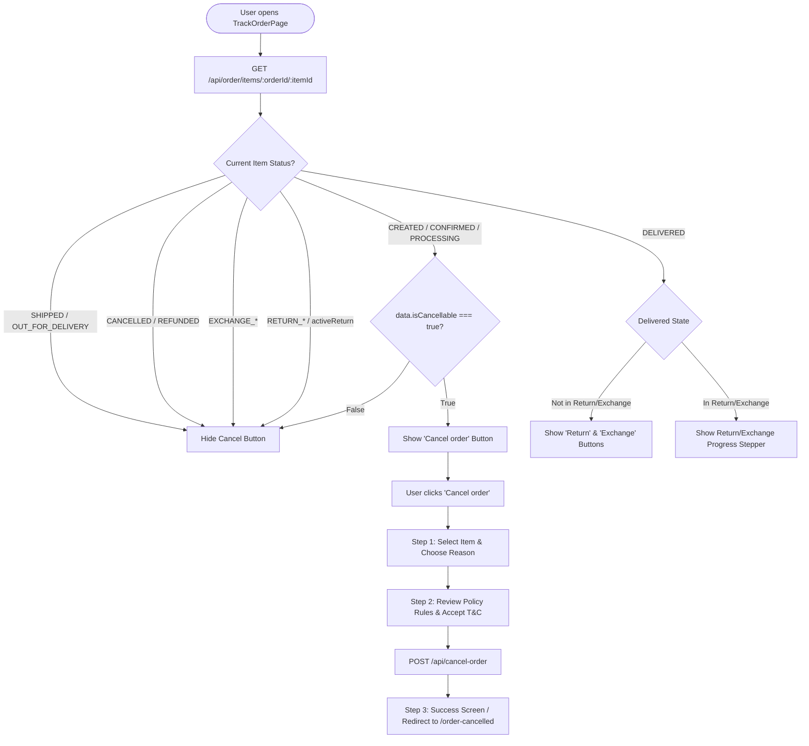

# Order Cancellation & Post-Purchase Action Management (`TrackOrderPage.jsx`)

Comprehensive technical reference on how the **Cancel Order button**, **Cancellation Windows**, **Backend Flags**, **Return Order Handling**, and **APIs & Response Contracts** are managed on the Khush platform.

---

## 1. Executive Summary & Flow Chart

The Cancel Order button lifecycle is guarded by a **three-tier validation system**:
1. **Backend Pre-computation**: `data.isCancellable === true` evaluated dynamically against active store policies and warehouse fulfillment state.
2. **Frontend State Gate**: `CANCEL_ORDER_UI_STATUSES.has(currentStatus)` (`CREATED`, `CONFIRMED`, `PROCESSING`).
3. **Flow Isolation**: Disabled if the item has entered an Exchange or Return flow.



---

## 2. When the Cancel Button is Visible (Rules & Logic)

In [`TrackOrderPage.jsx`](file:///c:/Users/dell/kushWeb/src/features/orders/TrackOrderPage.jsx#L1758-L1762), the visibility of the Cancel Order button is evaluated using:

```javascript
const CANCEL_ORDER_UI_STATUSES = new Set([
  "CREATED",
  "CONFIRMED",
  "PROCESSING",
]);

const isCancellable = data.isCancellable === true;

const showCancelOrderButton =
  isCancellable &&
  CANCEL_ORDER_UI_STATUSES.has(currentStatus) &&
  !EXCHANGE_STATUSES.includes(currentStatus);
```

### Exact Visibility Matrix

| Order / Item Lifecycle Status | `isCancellable` (Backend) | In Exchange / Return Flow? | Cancel Order Button Visible? | Reason / Explanation |
|---|---|---|---|---|
| `CREATED` (Order Placed) | `true` | No | ✅ **Visible** | Order placed, pending warehouse processing. |
| `CONFIRMED` (Payment Verified) | `true` | No | ✅ **Visible** | Order confirmed, before packing & dispatch. |
| `PROCESSING` (In Warehouse) | `true` | No | ✅ **Visible** | Being packed; still cancellable before carrier manifest. |
| `PROCESSING` (AWB Manifested) | `false` | No | ❌ **Hidden** | Carrier AWB generated by 3PL logistics (Shadowfax/Delhivery). |
| `SHIPPED` / `DISPATCHED` | Any | Any | ❌ **Hidden** | Package handed over to courier; cannot recall via simple cancel. |
| `OUT_FOR_DELIVERY` | Any | Any | ❌ **Hidden** | Courier out for delivery. |
| `DELIVERED` | Any | Any | ❌ **Hidden** | Delivered to customer; replaced by **Return** and **Exchange** buttons. |
| `CANCELLED` | Any | Any | ❌ **Hidden** | Order is already cancelled. |
| `RETURN_REQUESTED` to `RETURNED` | Any | Yes | ❌ **Hidden** | Order item is undergoing Return workflow. |
| `EXCHANGE_REQUESTED` to `COMPLETED` | Any | Yes | ❌ **Hidden** | Order item is undergoing Exchange workflow. |

---

## 3. Can a Return Order Be Cancelled?

### Is there a "Cancel" button for a Return Order?
* **On Storefront Self-Service UI**: **No.** Once an order item is `DELIVERED`, the standard `Cancel order` button is hidden and replaced by `Return` and `Exchange` buttons.
* If a customer submits a Return Request (`RETURN_REQUESTED` / `pickupScheduled`), the return cannot be aborted via the simple forward-order cancel button.

### How is Return Cancellation Managed?
1. **Via Support Chat Integration**:
   - Customer taps **"Chat with us"** on the tracking screen.
   - It invokes `openSupportChat` with `issueType: "ORDER_ISSUE"` or `"EXCHANGE"` and pre-populates item and return metadata.
   - The support executive or chatbot calls the admin/internal return cancellation endpoint.
2. **Via Carrier 3PL Webhook (Doorstep Customer Rejection)**:
   - When the reverse pickup courier arrives at the customer's doorstep and the customer refuses to hand over the item:
   - Courier webhook sends `rawStatus: "cancelled_by_customer"` or `"na"` (Not available).
   - Backend updates `returnDoc.status = "returnCancelled"` and restores the line item status to `DELIVERED`.

---

## 4. Cancellation Time Windows & Policy Enforcement

Cancellation limits are dynamically driven by the store's **Active Cancellation Policy** fetched from `GET /admin/cancellation-policies/getActive`.

### 4.1 Time Limit Parameters
* **Policy Time Window**: Typically **12 to 24 hours** from `orderCreatedAt` OR **until warehouse packaging/manifest**.
* **Hard Operational Cut-off**: Once the 3PL shipping label / AWB is generated (`sfx.awb`, `dl.waybill`, or `sr.awbCode`), the backend flips `isCancellable = false`, immediately removing the button on the frontend.

### 4.2 Dynamic Policy Integration

When `TrackOrderPage` mounts, it queries `policyService.getActiveCancellation()`:

```javascript
useEffect(() => {
  if (!isAuthenticated) return;

  policyService
    .getActiveCancellation()
    .then((res) => {
      const payload = res?.data?.data ?? res?.data;
      if (payload) setCancelPolicy(payload);
    })
    .catch(() => {
      setCancelPolicy(null); // Falls back to FALLBACK_CANCEL_REASONS
    });
}, [isAuthenticated]);
```

---

## 5. Backend Flags & API Specifications

### 5.1 Order Item Detail API

- **Endpoint**: `GET /api/order/items/:orderId/:itemId`
- **Headers**: `Authorization: Bearer <userToken>`

#### Response Payload (`data` structure):
```json
{
  "success": true,
  "data": {
    "orderId": "65f290a1b2c3d4e5f6789012",
    "itemId": "item_890123456",
    "status": "CONFIRMED",
    "isCancellable": true,
    "isExchangeable": false,
    "orderCreatedAt": "2026-09-09T08:30:00.000Z",
    "orderUpdatedAt": "2026-09-09T08:35:00.000Z",
    "deliveryType": "NORMAL",
    "item": {
      "name": "Emerald Royal Necklace",
      "brand": "Khush",
      "quantity": 1,
      "unitPrice": 2499,
      "itemSubtotal": 2499,
      "finalPayable": 2499,
      "variant": {
        "color": "Emerald Green",
        "size": "Free Size",
        "imageUrl": "https://cdn.khush.com/products/necklace_1.jpg"
      }
    },
    "pricing": {
      "paymentMode": "RAZORPAY",
      "paymentStatus": "PAID"
    },
    "statusHistory": [
      {
        "status": "CREATED",
        "createdAt": "2026-09-09T08:30:00.000Z",
        "notes": "Order placed"
      },
      {
        "status": "CONFIRMED",
        "createdAt": "2026-09-09T08:35:00.000Z",
        "notes": "Payment confirmed via Razorpay"
      }
    ]
  }
}
```

### 5.2 Active Cancellation Policy API

- **Endpoint**: `GET /api/admin/cancellation-policies/getActive`
- **Headers**: `Authorization: Bearer <userToken>`

#### Response Payload:
```json
{
  "success": true,
  "data": {
    "_id": "pol_cancel_active_01",
    "name": "Standard Cancellation Policy",
    "description": "Orders can be cancelled before warehouse dispatch.",
    "cancellationReasons": [
      "Changed my mind",
      "Wrong size or color",
      "Ordered by mistake",
      "Found a better price elsewhere",
      "Delivery too late",
      "Other"
    ],
    "policies": {
      "cancellationWindow": "Up to 24 hours or until shipment dispatch",
      "refundMethod": "Issued as store credit/coupon within 24 hours for online payments",
      "codOrders": "No charges applicable for COD orders cancelled before dispatch"
    },
    "maxCancellationTimeInHours": 24
  }
}
```

### 5.3 Cancel Order Item API

- **Endpoint**: `POST /api/cancel-order`
- **Headers**: `Content-Type: application/json`, `Authorization: Bearer <userToken>`

#### Request Payload:
```json
{
  "orderId": "65f290a1b2c3d4e5f6789012",
  "itemId": "item_890123456",
  "reason": "Ordered by mistake",
  "couponIssued": true
}
```

#### Successful Response (`200 OK`):
```json
{
  "success": true,
  "message": "Order item cancelled successfully",
  "data": {
    "orderId": "65f290a1b2c3d4e5f6789012",
    "itemId": "item_890123456",
    "status": "CANCELLED",
    "cancelledAt": "2026-09-09T10:15:00.000Z",
    "refundMode": "COUPON",
    "couponCode": "REFUND-2499-XYZ",
    "couponAmount": 2499
  }
}
```

#### Error Responses:
| HTTP Status | Message | Root Cause |
|---|---|---|
| `400 Bad Request` | `"Item is already manifested and cannot be cancelled"` | Carrier AWB generated right before click. |
| `400 Bad Request` | `"Cancellation window has expired"` | Order placed older than policy window. |
| `404 Not Found` | `"Order item not found"` | Invalid `orderId` or `itemId`. |
| `401 Unauthorized` | `"Invalid or expired authentication token"` | User session timeout. |

---

## 6. Step-by-Step Cancel Modal Flow (UI / UX)

When the user clicks **"Cancel order"**, a 3-step modal sequence manages user input, policy acceptance, and submission:

```
[Step 1: Reason Selection]
  ├── Radio selection of the target line item (if multiple booked items exist)
  ├── Radio selection of cancellation reason (dynamically populated from policy)
  └── CTA: "Continue" (Moves to Step 2)

[Step 2: Policy & Terms Acceptance]
  ├── Displays active policy name, description, and detailed rules
  ├── Checkbox: "I accept the terms and conditions of the cancellation and refund policy."
  └── CTA: "Continue" (Disabled until checkbox is checked; triggers POST /api/cancel-order)

[Step 3: Confirmation Screen]
  ├── Displays Success Checkmark icon
  ├── For COD: "This order item has been cancelled."
  ├── For Online Payment (Prepaid): "The refund coupon will be added to your Coupons section within 24 hours."
  └── Navigates to `/order-cancelled` or provides direct link to `/coupons`
```

---

## 7. Comparative Summary of Action Buttons

| Feature | Cancel Order | Return Order | Exchange Order |
|---|---|---|---|
| **Eligible Statuses** | `CREATED`, `CONFIRMED`, `PROCESSING` | `DELIVERED` | `DELIVERED` |
| **Backend Flag Required** | `isCancellable === true` | `isNormalDelivery === true` | `isExchangeable !== false` |
| **Active Document Lock** | Blocked if in exchange | Blocked if active return exists | Blocked if active exchange exists |
| **API Invoked** | `POST /api/cancel-order` | `POST /api/return-user/create` | `POST /api/exchangeUser/create` |
| **Data Format** | JSON `{ orderId, itemId, reason }` | Multipart Form + Unboxing Video | Multipart Form + Variant + 3-5 Photos |
| **Post-Action State** | `CANCELLED` | `RETURN_REQUESTED` | `EXCHANGE_REQUESTED` |
| **Refund Method** | Wallet / Coupon / Source | Wallet / Source (Post QC) | Replacement dispatched |
