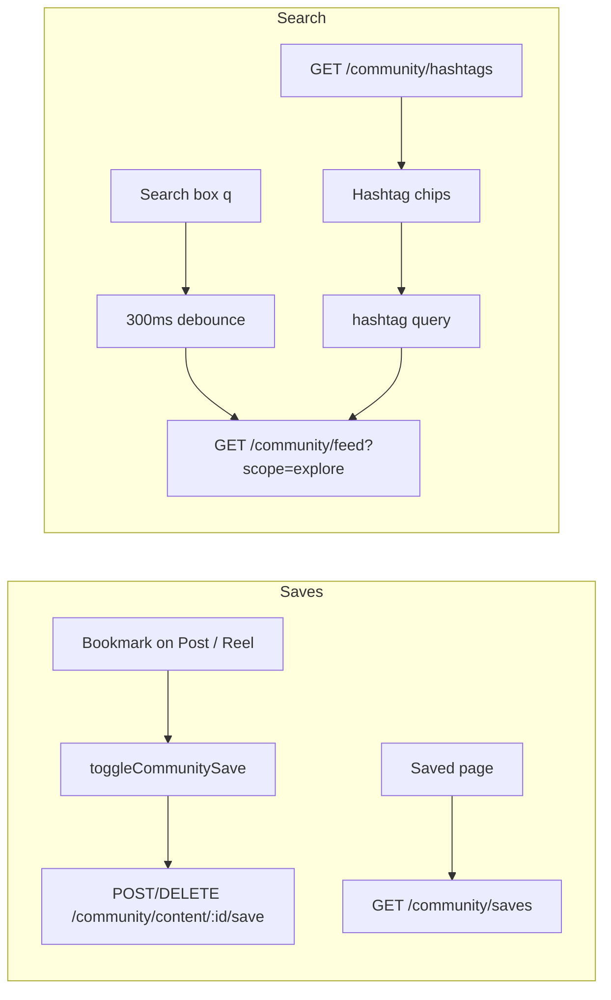

# Community Saves & Keyword / Hashtag Search

How **saves (favourites)** and **search / hashtag keywords** work on the Khush Web community feed.

---

## 1. Overview



| Feature | Route | Primary APIs |
| :--- | :--- | :--- |
| Save / unsave | Any feed / reels | `POST` / `DELETE` `/api/community/content/:id/save` |
| Favourites grid | `/community/feed/saved` | `GET /api/community/saves?type=post\|reel` |
| Search / explore | `/community/feed/search` | `GET /api/community/feed?scope=explore&q=&hashtag=` |
| Keyword chips | Search page | `GET /api/community/hashtags` |

---

## 2. Community Saves

### 2.1 User actions

| UI | File | Behaviour |
| :--- | :--- | :--- |
| Bookmark on feed post | `PostCard.jsx` → `CommunityFeedHome.jsx` | Calls `toggleCommunitySave(post, patchItem, social)` |
| Bookmark on reel | `ReelActions` → `CommunityReelsFeed.jsx` | Same toggle helper |
| Favourites page | `CommunitySavedFeed.jsx` | Lists saved posts / reels in a grid |

Sidebar item **Saved** → route `ROUTES.COMMUNITY_SAVED` (`/community/feed/saved`).

### 2.2 Toggle save (optimistic)

Flow lives in:

- `toggleCommunitySave` — `src/features/community/hooks/useCommunityFeed.js`
- `CommunitySocialContext.toggleSave` — global `contentId → boolean` map

```text
1. Read current isSaved (prefer global social store over item flag)
2. Optimistically flip UI (patchItem + context)
3. API:
   - save   → POST   /api/community/content/:contentId/save
   - unsave → DELETE /api/community/content/:contentId/save
4. On error → rollback local + context state
```

Service wrappers (`community.service.js`):

```js
communityService.save(contentId)    // POST  /community/content/:id/save
communityService.unsave(contentId)  // DELETE /community/content/:id/save
```

### 2.3 Why a global social store?

`CommunitySocialProvider` keeps save / like / follow flags in memory so **Home ↔ Reels ↔ Search** stay in sync even if a later feed refetch returns a stale `isSaved`.

- `seedFromContentItems(items)` — seeds flags from API rows without overwriting user toggles already set
- `withSocial(item)` — merges live flags onto each card / reel

### 2.4 Favourites page load

`CommunitySavedFeed` → `useCommunitySaves({ type })`

| Tab | `type` query | Label |
| :--- | :--- | :--- |
| Images | `post` | Posts |
| Reels | `reel` | Reels |

```text
GET /api/community/saves?type=post|reel&limit=20
  → extractSavesList(data)     // items | saves | array
  → mapSaveItem(row)           // unwraps row.content / post / reel
  → seed isSaved: true into social store
  → grid of thumbnails
```

Mapper: `mapSaveItem` / `extractSavesList` in `communityContent.mappers.js`.

Supported save-row shapes:

- `{ saveId, savedAt, content }`
- `{ contentId, content }`
- content object itself (`_id` / `media`)

### 2.5 Opening a saved item

| Type | Action |
| :--- | :--- |
| Post | `openPost(item)` (layout outlet) |
| Reel | `navigateToReel` with playlist of saved reels, `source: 'saved'` |

---

## 3. Keyword Search & Hashtags

### 3.1 Search page

Route: `/community/feed/search` → `CommunitySearchFeed.jsx`

#### A. Free-text keyword (`q`)

1. User types in the search input.
2. Value is **debounced 300ms** → `debouncedQ`.
3. Feed hook runs:

```js
useCommunityFeed({
  scope: 'explore',
  type: 'all' | 'post' | 'reel',  // from All / Posts / Reels chips
  q: debouncedQ || undefined,
  hashtag: /* see below */,
})
```

4. Service builds:

```text
GET /api/community/feed?scope=explore&type=...&q=<keyword>&limit=20&cursor=...
```

`q` also accepts aliases in the service layer: `keyword` / `search` → sent as `q`.

#### B. Hashtag / keyword chips

On mount, search page loads keyword chips:

```text
GET /api/community/hashtags
```

Response handling (`CommunitySearchFeed.jsx`):

```js
const list = data?.items ?? (Array.isArray(data) ? data : [])
const labels = list.map((h) =>
  typeof h === 'string' ? h : h?.keyword || h?.name || h?.tag
).filter(Boolean)
```

Chip row built as:

```text
['All', 'Posts', 'Reels', ...up to 8 hashtags with leading #]
```

Fallback if hashtags API fails: `SEARCH_FILTERS` from `mockFeed.js` (minus `All`).

#### C. Selecting a hashtag chip

When filter is **not** `All` / `Posts` / `Reels`:

```js
hashtag: filter.replace(/^#/, '')   // e.g. "SummerEdit"
```

That becomes:

```text
GET /api/community/feed?scope=explore&hashtag=SummerEdit&type=...
```

`Posts` / `Reels` only change `type` (`post` / `reel`); they do **not** set `hashtag`.

### 3.2 Feed API contract (search)

| Query param | Meaning |
| :--- | :--- |
| `scope=explore` | Discovery / search corpus (not following-only) |
| `type` | `all` \| `post` \| `reel` |
| `q` | Free-text keyword (style, creator, collection text) |
| `hashtag` | Single tag without `#` |
| `limit` / `cursor` | Pagination |

Implemented in `communityService.getFeed` → `GET /community/feed`.

### 3.3 Hashtags on post captions (display only)

`PostCard` renders caption hashtags from `post.hashtags` **or** parses `#tags` from caption text via regex. That is **UI display**, not the search keyword API.

Publish payloads can include `hashtags` arrays when creating posts/reels (see upload / publish flow).

### 3.4 Home right-rail “Trending Hashtags”

`CommunityFeedLayout` still shows `TrendingHashtags` with **mock** data (`TRENDING_HASHTAGS` in `mockFeed.js`). Those chips are **not** wired to `/community/hashtags` or feed filter yet — live keyword chips live on the **Search** page only.

---

## 4. Key source files

| Layer | Path |
| :--- | :--- |
| Save / feed hooks | `src/features/community/hooks/useCommunityFeed.js` |
| Global save state | `src/features/community/context/CommunitySocialContext.jsx` |
| Favourites UI | `src/features/community/feed/CommunitySavedFeed.jsx` |
| Search UI | `src/features/community/feed/CommunitySearchFeed.jsx` |
| API client | `src/services/community.service.js` |
| Mappers | `src/services/communityContent.mappers.js` (`mapSaveItem`, `extractSavesList`) |
| Routes | `src/app/routes/index.jsx` → `search`, `saved` under community feed layout |

---

## 5. Quick API reference

| Method | Endpoint | Purpose |
| :--- | :--- | :--- |
| `POST` | `/api/community/content/:id/save` | Save content |
| `DELETE` | `/api/community/content/:id/save` | Unsave content |
| `GET` | `/api/community/saves?type=&limit=&cursor=` | List favourites |
| `GET` | `/api/community/hashtags` | Keyword / hashtag chips for search |
| `GET` | `/api/community/feed?scope=explore&q=&hashtag=&type=` | Search results |

---

## 6. Auth / capability notes

- Saved nav appears for logged-in community roles (`capabilities.js` includes `saved` for creator / designer / joined user).
- Save / unsave and `/saves` require authenticated Bearer token via `axiosClient`.
- Guests hitting community feed are redirected to auth by `CommunityFeedLayout` before these pages load.
