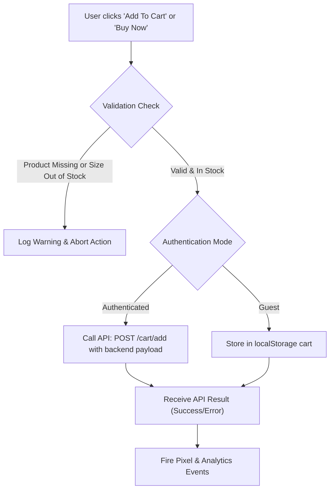

# Product Details Page Developer Debugging Guide

This guide documents the development-mode console logging system implemented in [`src/features/product/ProductPage.jsx`](file:///c:/Users/dell/kushWeb/src/features/product/ProductPage.jsx). It details all API endpoints, variant stock evaluations, click interaction listeners, and the Add to Cart lifecycle for both static and API-driven items.

---

## 1. Development Mode Activation

The logging system is automatically active in development mode via:
```javascript
const isDev = Boolean(import.meta.env?.DEV || isLoggingEnabled());
```

- **In Dev (`npm run dev` or `VITE_APP_ENV=dev`)**: All logs, formatted tables, and warning groups are rendered in the browser DevTools console.
- **In Production (`VITE_APP_ENV=prod`)**: Silenced to preserve performance and prevent console pollution.

---

## 2. Console Category Reference

All logs use visual CSS badges and standard groups so you can filter by category in DevTools:

| Category Badge | Filter Term | Description |
| :--- | :--- | :--- |
| `[ProductDetails:API]` | `API` | Request endpoints, query parameters, payloads, and response data |
| `[ProductDetails:Variants]` | `Variants` | Inventory tables, sizes, SKUs, in-stock / out-of-stock counts |
| `[ProductDetails:Out-Of-Stock]` | `Out-Of-Stock` | Warnings when out-of-stock variants are clicked or checked |
| `[ProductDetails:Click]` | `Click` | User clicks on colors, sizes, media, zoom, accordions, and modals |
| `[ProductDetails:AddToCart]` | `AddToCart` | End-to-end cart payload building, stock checks, and API response |

---

## 3. API Calls & Endpoints

### 3.1 Single Product Details
- **Endpoint**: `GET /items/single/:id` (via `itemsService.getById(id, params)`)
- **Query Params**:
  ```json
  {
    "pincode": "110001"
  }
  ```
- **Console Log**:
  - `[ProductDetails:API] Request: Fetch Product Details By ID`
  - `[ProductDetails:API] Response: Product Details Received`
- **Logged Properties**:
  - `itemId`, `name`, `price`, `discountedPrice`, `variantsCount`, `deliveriesCount`, `rawData`

### 3.2 Delivery Service Check by Pincode
- **Endpoint**: `GET /delivery/check/:pincode` (via `deliveryService.checkByPincode(pincode)`)
- **Console Log**:
  - `[ProductDetails:API] Request: Check Delivery by Pincode`
  - `[ProductDetails:API] Response: Delivery Options Received`
- **Output**: Array of delivery methods (`90_MIN`, `ONE_DAY`, `Standard`, etc.) and delivery fees.

---

## 4. Variant & Inventory Evaluation

When a product loads, all variants and sizes are parsed to evaluate availability:

### 4.1 Stock Determination Logic
For each size entry:
```javascript
const qty = Number(s.availableQuantity ?? s.stock ?? 0);
const inStock = s.inStock === true || (s.inStock !== false && qty > 0);
```

### 4.2 Tabular Inventory Log (`console.table`)
The console prints an inventory matrix under `[ProductDetails:Variants] Product Variants & Stock Inventory Breakdown`:

| VariantIndex | Color | Size | SKU | StockQty | InStockFlag | Status |
| :--- | :--- | :--- | :--- | :--- | :--- | :--- |
| `0` | Black | S | `BLK-S-01` | 4 | `true` | `✅ In Stock` |
| `0` | Black | M | `BLK-M-01` | 0 | `false` | `❌ OUT OF STOCK` |
| `1` | White | L | `WHT-L-02` | 2 | `true` | `✅ In Stock` |

### 4.3 Initial Auto-Selection
- The component scans all variants and automatically picks the first variant and size where `inStock === true`.
- If all items are out of stock, it falls back to the first variant and logs:
  `SelectionReason: "Fallback: Selected first variant because all variants are out of stock"`

---

## 5. User Interaction & Click Handlers

Every interactive click in the product details screen outputs context about the user's action:

### 5.1 Color Swatch Click
- **Log**: `[ProductDetails:Click] Color Selected`
- **Context Output**:
  ```javascript
  {
    clickedColor: "Black",
    hex: "#000000",
    availableSizesForColor: [ { size: "S", inStock: true, qty: 4 }, ... ],
    inStockSizes: ["S", "L"],
    outOfStockSizes: ["M"],
    imagesCount: 3
  }
  ```

### 5.2 Size Button Click
- **If Size is in stock**:
  - **Log**: `[ProductDetails:Click] Size Selected`
  - **Context Output**: `{ selectedSize: "S", sku: "BLK-S-01", inStock: true, color: "Black" }`
- **If Size is OUT OF STOCK**:
  - **Log**: `[ProductDetails:Out-Of-Stock] Clicked Size is OUT OF STOCK`
  - **Context Output**:
    ```javascript
    {
      size: "M",
      sku: "BLK-M-01",
      color: "Black",
      inStock: false,
      message: "Selection ignored because variant size is out of stock"
    }
    ```

### 5.3 Color Change Auto Size Adjustment
When switching colors, if the previously selected size does not exist or is out of stock in the newly selected color, the system automatically finds the first available in-stock size in the new color:
- **Log**: `[ProductDetails:Variants] Color change updated available sizes`
- **Context Output**: `{ previousSize, newSelectedSize, availableSizesForThisColor, outOfStockSizesForThisColor }`

### 5.4 Media & Zoom Clicks
- **Thumbnail Click**: `[ProductDetails:Click] Gallery thumbnail clicked` (`{ imageIndex, mediaType, url, totalImages }`)
- **Zoom Lightbox**: `[ProductDetails:Click] Main media clicked - Opening zoom lightbox` (`{ imageIndex, url }`)

### 5.5 Accordion & Secondary Actions
- **Accordion Toggle**: `[ProductDetails:Click] Accordion section toggled` (`{ section: "details" | "care" | "return", action: "expanded" | "collapsed" }`)
- **Descriptions**: `[ProductDetails:Click] Short description toggle clicked` / `Long description toggle clicked`
- **Size Chart**: `[ProductDetails:Click] Size Chart link clicked`
- **Wishlist**: `[ProductDetails:Click] Wishlist button clicked` (`{ action: "Add to wishlist" | "Remove from wishlist", currentlyInWishlist }`)
- **Share**: `[ProductDetails:Click] Share button clicked` (`{ url, itemId }`)
- **Customer Reviews**: `[ProductDetails:Click] Rating badge clicked - Scrolling to reviews` / `Write a Review modal opened`

---

## 6. Add to Cart & Buy Now Flow

The Add to Cart action runs through a 4-step sequence logged under `[ProductDetails:AddToCart]`:



### 6.1 Step 1: Pre-Validation Check
Logs user authentication state, selected SKU, variant in-stock flag, and static fallback properties:
```javascript
{
  userStatus: "Logged In User" | "Guest User",
  userId: "...",
  pincode: "110001",
  selectedColor: "Black",
  selectedSize: "S",
  selectedSizeObj: { size: "S", sku: "BLK-S-01", inStock: true },
  isVariantInStock: true,
  staticFieldsCheck: {
    isStaticImageFallback: false,
    isStaticRatingFallback: false,
    isStaticDeliveryFallback: false
  }
}
```

> [!WARNING]
> If `productForCart` is null or `selectedSizeObj.inStock === false`, the button click is blocked and emits `[ProductDetails:Out-Of-Stock] Add To Cart BLOCKED`.

### 6.2 Step 2: Context & Payload Execution
- **Logged In**: Calls `cartService.add(payload)` which posts to `POST /cart/add`:
  ```json
  {
    "itemId": "664f...",
    "sku": "BLK-S-01",
    "variant": {
      "color": "Black",
      "size": "S",
      "sku": "BLK-S-01",
      "imageUrl": "https://..."
    },
    "quantity": 1,
    "pincode": "110001"
  }
  ```
- **Guest**: Appends the item to the guest cart in `localStorage`.

### 6.3 Step 3: Result Handling
Logs the response from the cart service (`{ success: true }` or `{ success: false, message: "..." }`).

### 6.4 Step 4: Analytics Dispatch
Logs the payload dispatched to marketing pixels and internal analytics:
- `trackPixelAddToCart({ id, name, price, quantity, sku })`
- `trackEvent({ eventType: "add_to_cart", itemId, sku, quantity, price, currency: "INR" })`

---

## 7. How to Test in Browser DevTools

1. Start your local dev server:
   ```bash
   npm run dev
   ```
2. Navigate to any product page (e.g. `http://localhost:5173/product/<productId>`).
3. Press `F12` to open DevTools and select the **Console** tab.
4. Try the following tests:
   - Click a color swatch to see the sizes and stock for that color.
   - Click an out-of-stock size to see the out-of-stock warning log.
   - Click **Add to Cart** to see the 4-step payload flow and API response.
   - Use the console filter box and type `[ProductDetails:` to inspect only product details logs.
