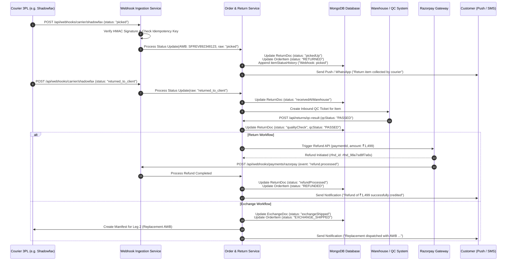
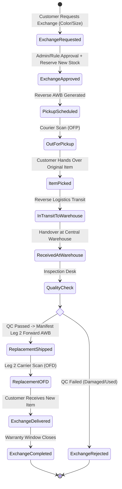

# Return & Exchange Flow, Tracking Management, Status Flags & Webhooks Architecture

Complete technical specification and integration architecture for **Return & Exchange Lifecycles**, **Reverse Logistics Tracking**, **Order Status & Carrier Flag Management**, and **Carrier/Payment Webhook Ingestion** across the Khush e-commerce platform.

---

## 1. System Overview & Architecture

The Khush order management and post-purchase ecosystem manages forward shipments, reverse pickups (returns), and two-leg exchange workflows. It unifies status states from multiple 3rd-party logistics (3PL) partners (**Shadowfax**, **Delhivery**, **Shiprocket**, and **Self-Shipping**) with internal item lifecycles and payment gateways (**Razorpay**).

```mermaid
flowchart TD
    subgraph ClientLayer["Storefront & Mobile Client"]
        UI_OrderList["Orders List Page"]
        UI_TrackPage["Track Order Page & Stepper"]
        UI_Exchange["Exchange / Return Request Modal"]
    end

    subgraph APILayer["API Gateway & Backend Services"]
        API_Orders["Order Service (/api/order)"]
        API_Exchange["Exchange Service (/api/exchangeUser)"]
        API_Returns["Return Service (/api/returnUser)"]
        API_Tracking["Tracking & Normalization Engine"]
        API_Webhooks["Webhook Ingestion (/api/webhooks/...)"]
    end

    subgraph LogisticsLayer["3PL Logistics & Couriers"]
        SFX["Shadowfax Logistics (Reverse & Forward)"]
        DLV["Delhivery Direct (Waybill)"]
        SRK["Shiprocket API"]
        SELF["Khush Fleet (Self Shipping)"]
    end

    subgraph PaymentInventoryLayer["Payment & Inventory"]
        RPAY["Razorpay Refund / Bank Payouts"]
        WMS["Warehouse Management / QC Desk"]
        INV["Inventory & Stock Reservation"]
    end

    UI_Exchange -->|POST /exchangeUser/create| API_Exchange
    UI_Exchange -->|POST /returnUser/create| API_Returns
    UI_OrderList & UI_TrackPage -->|GET /order/items/:id| API_Orders
    API_Orders --> API_Tracking

    API_Returns & API_Exchange -->|Manifest Pickup| SFX & DLV & SRK
    SFX & DLV & SRK -->|Realtime Status Webhooks| API_Webhooks
    API_Webhooks -->|Normalize & Append History| API_Tracking
    API_Webhooks -->|Update Status| API_Orders

    WMS -->|QC Approved / Rejected| API_Orders
    API_Orders -->|QC Passed (Return)| RPAY
    API_Orders -->|QC Passed (Exchange)| INV
    INV -->|Dispatch Replacement| SFX & DLV & SRK
```

---

## 2. Core Entities & Data Schema

### 2.1 Order Line Item Tracking Model

An order item contains both Khush state management properties and carrier-specific manifest objects.

```typescript
interface OrderItem {
  itemId: string;
  orderId: string;
  productId: string;
  variantId?: string;
  quantity: number;
  price: number;
  discountedPrice?: number;
  
  // Khush High-Level Lifecycle Status
  status: KhushItemStatus;
  
  // Carrier Snapshot (Normalized for fast client rendering)
  carrierTracking?: {
    trackingNumber: string;        // AWB / Waybill / Tracking ID
    trackingUrl: string | null;    // Dynamic or static tracking link
    status: string;               // Formatted UI scan label (e.g., 'Return item collected')
    rawStatus: string;            // Raw carrier scan code (e.g., 'picked', 'ofp')
    courier: string;              // 'Shadowfax' | 'Delhivery' | 'Shiprocket' | 'Khush delivery'
    provider: 'SHADOWFAX' | 'DELHIVERY' | 'SHIPROCKET' | 'SELF_SHIPPING';
    leg: 'FORWARD' | 'REVERSE_PICKUP' | 'EXCHANGE_REPLACEMENT';
    selfShipping: boolean;
    selfShippingMode?: 'DELIVERY' | 'PICKUP' | null;
    updatedAt: string;
  };

  // Third-party carrier direct payloads
  shadowfax?: {
    awb?: string;
    orderId?: string;
    status?: string;
    trackingUrl?: string;
    pickupDetails?: object;
  };
  delhivery?: {
    waybill?: string;
    lrn?: string;
    status?: string;
    trackingUrl?: string;
  };
  shiprocket?: {
    shipmentId?: number;
    orderId?: number;
    awbCode?: string;
    courierCompanyId?: number;
    status?: string;
    trackingUrl?: string;
  };

  // Historical audit log of every state change & webhook scan
  itemStatusHistory: Array<{
    status: KhushItemStatus | string;
    createdAt: string;
    notes?: string;               // e.g. "Webhook: OFP", "Shadowfax order manifested"
    courier?: string;
    trackingId?: string;
    updatedBy?: 'SYSTEM' | 'ADMIN' | 'WEBHOOK' | 'USER';
  }>;

  // Active sub-document associations
  returnDoc?: ReturnDocument;
  exchangeDoc?: ExchangeDocument;
}
```

### 2.2 Return Document Schema (`ReturnDoc`)

```typescript
interface ReturnDocument {
  returnId: string;
  orderId: string;
  itemId: string;
  userId: string;
  reason: string;
  customerNotes?: string;
  evidenceImages: string[];      // Presigned S3 URLs uploaded by customer
  status: ReturnDocStatus;       // camelCase backend status
  
  // Reverse Pickup Details
  pickupAddress: Address;
  pickupProvider: 'SHADOWFAX' | 'DELHIVERY' | 'SHIPROCKET' | 'SELF_SHIPPING';
  reverseAwb: string;
  pickupScheduledDate?: string;
  pickupSlot?: string;
  
  // Warehouse & QC Verification
  warehouseReceivedAt?: string;
  qcStatus?: 'PENDING' | 'PASSED' | 'FAILED' | 'PARTIAL';
  qcNotes?: string;
  qcImages?: string[];
  
  // Refund Details
  refundMethod: 'ORIGINAL_SOURCE' | 'UPI' | 'BANK_TRANSFER' | 'STORE_CREDIT';
  refundAmount: number;
  refundTransactionId?: string;
  refundProcessedAt?: string;
  
  createdAt: string;
  updatedAt: string;
}
```

### 2.3 Exchange Document Schema (`ExchangeDoc`)

```typescript
interface ExchangeDocument {
  exchangeId: string;
  orderId: string;
  itemId: string;
  userId: string;
  reason: string;
  evidenceImages: string[];
  status: ExchangeDocStatus;     // camelCase backend status
  
  // Target Replacement Product
  desiredSize?: string;
  desiredColor?: string;
  replacedItem: {
    productId: string;
    variantId: string;
    name: string;
    size?: string;
    color?: string;
    price: number;
  };
  
  // Leg 1: Reverse Pickup (Customer -> Warehouse)
  reverseShipping: {
    provider: 'SHADOWFAX' | 'DELHIVERY' | 'SHIPROCKET' | 'SELF_SHIPPING';
    awb: string;
    trackingUrl?: string;
    pickupScheduledAt?: string;
    pickedUpAt?: string;
    receivedAtWarehouseAt?: string;
    rawStatus?: string;
  };

  // Warehouse QC
  qcStatus?: 'PENDING' | 'PASSED' | 'FAILED';
  qcNotes?: string;

  // Leg 2: Forward Replacement (Warehouse -> Customer)
  replacementShipping?: {
    newItemId: string;
    provider: 'SHADOWFAX' | 'DELHIVERY' | 'SHIPROCKET' | 'SELF_SHIPPING';
    awb: string;
    trackingUrl?: string;
    shippedAt?: string;
    deliveredAt?: string;
    rawStatus?: string;
  };

  createdAt: string;
  updatedAt: string;
}
```

---

## 3. Status Enums & Mapping Matrix

The Khush platform uses three interconnected status levels:
1. **Khush Item Status (`itemStatus`)**: Global uppercase state used for business logic, RBAC, cancel/return eligibility.
2. **Document Status (`returnDoc.status` / `exchangeDoc.status`)**: CamelCase document workflow state.
3. **Carrier Raw Status (`rawStatus`)**: Exact string sent by 3PL courier webhooks / scans.

### 3.1 Return Lifecycle Status Matrix

| Stepper Step Index | Return Stepper Label | `returnDoc.status` (Backend) | `itemStatus` (Line Enum) | Carrier Raw Scans (`rawStatus`) | Status Badge Tone |
|---|---|---|---|---|---|
| **0** | Return requested | `returnRequested` | `RETURN_REQUESTED` | `new` | `exchange` (Blue) |
| **1** | Return approved | `returnApproved` | `RETURN_APPROVED` | `assigned_for_pickup` | `exchange` (Blue) |
| **2** | Return pickup scheduled | `pickupScheduled` | `RETURN_PICKUP_SCHEDULED` | `scheduled`, `pending` | `exchange` (Blue) |
| **3** | Return out for pickup | `outForPickup` / `pickingUp` | `RETURN_PICKUP_SCHEDULED` | `ofp`, `out_for_pickup`, `picking` | `transit` (Violet) |
| **4** | Return item collected | `pickedUp` | `RETURNED` | `picked`, `picked_up`, `received` | `exchange` (Orange) |
| **5** | Return in transit to warehouse | `inTransit` | `RETURNED` | `in_transit_for_return`, `bag_in_transit`, `received_at_hub`, `received_at_return_dc`, `item_added_to_bag`, `bag_received` | `transit` (Violet) |
| **6** | Return delivered to warehouse | `receivedAtWarehouse` | `RETURNED` | `returned_to_client`, `rto_d` | `transit` (Violet) |
| **7** | Return quality check | `qualityCheck` | `RETURNED` | — | `processing` (Amber) |
| **8** | Return refund processed | `refundProcessed` | `REFUNDED` | `completed` | `success` (Green) |
| **-1** | Return rejected | `returnRejected` | `CONFIRMED` / `DELIVERED` | `cancelled`, `cancelled_by_customer` | `danger` (Red) |

### 3.2 Exchange Lifecycle Status Matrix

| Stage | Exchange Step Label | `exchangeDoc.status` | `itemStatus` | Associated Carrier Leg |
|---|---|---|---|---|
| **Initiation** | Exchange requested | `exchangeRequested` | `EXCHANGE_REQUESTED` | — |
| **Approval** | Exchange approved | `exchangeApproved` | `EXCHANGE_APPROVED` | — |
| **Leg 1: Pickup Scheduled** | Exchange pickup scheduled | `pickupScheduled` | `EXCHANGE_PICKUP_SCHEDULED` | Leg 1: Reverse Pickup |
| **Leg 1: Out for Pickup** | Out for exchange pickup | `outForPickup` | `EXCHANGE_OUT_FOR_PICKUP` | Leg 1: Carrier Scan (`ofp`) |
| **Leg 1: Item Picked** | Item picked for exchange | `pickedUp` | `EXCHANGE_PICKED` | Leg 1: Carrier Scan (`picked`) |
| **Leg 1: In Transit** | In transit to warehouse | `inTransit` | `EXCHANGE_PICKED` | Leg 1: Carrier Scan (`bag_in_transit`) |
| **Leg 1: Received** | Exchange received at warehouse | `receivedAtWarehouse` | `EXCHANGE_RECEIVED` | Leg 1: Scan (`returned_to_client`) |
| **QC Verification** | Quality check / processing | `qualityCheck` | `EXCHANGE_PROCESSING` | Warehouse QC Desk |
| **Leg 2: Shipped** | Replacement shipped | `exchangeShipped` | `EXCHANGE_SHIPPED` | Leg 2: Forward AWB Manifested |
| **Leg 2: Out for Delivery** | Replacement out for delivery | `outForDelivery` | `EXCHANGE_OUT_FOR_DELIVERY` | Leg 2: Forward Scan (`ofd`) |
| **Leg 2: Delivered** | Exchange delivered | `exchangeDelivered` | `EXCHANGE_DELIVERED` | Leg 2: Forward Scan (`delivered`) |
| **Completed** | Exchange completed | `exchangeCompleted` | `EXCHANGE_COMPLETED` | Closed |
| **Rejected** | Exchange rejected | `exchangeRejected` | `EXCHANGE_REJECTED` | Reverse Leg Cancelled / QC Failed |

---

## 4. Reverse Logistics Tracking Management

### 4.1 Carrier AWB & Provider Resolution Logic

The frontend and backend automatically determine the courier provider using AWB patterns and shipment metadata:

```javascript
export function inferManifestProvider(item = {}, shipment = null) {
  const line = item || {};
  const ship = shipment || {};
  const sfx = line.shadowfax || ship.shadowfax || {};
  const dl = line.delhivery || ship.delhivery || {};
  const sr = line.shiprocket || ship.shiprocket || {};
  
  const trackingId =
    sfx.awb ||
    dl.waybill ||
    sr.awbCode ||
    line.trackingId ||
    ship.trackingId ||
    null;

  // Shadowfax AWB pattern: SF followed by alphanumeric characters
  if (sfx.awb || /^SF[A-Z0-9]+$/i.test(String(trackingId || '').trim())) {
    return 'SHADOWFAX';
  }
  if (dl.waybill) return 'DELHIVERY';
  if (sr.awbCode) return 'SHIPROCKET';
  return String(line.shippingProvider || ship.shippingProvider || '').toUpperCase() || null;
}
```

### 4.2 Dynamic Tracking URL Resolution

| Provider | Tracking Link Pattern | Direct Carrier Tracking Supported |
|---|---|---|
| **Shadowfax** | `https://tracker.shadowfax.in/#/awb/{AWB}` | ✅ Yes |
| **Delhivery** | `https://www.delhivery.com/track/package/{WAYBILL}` | ✅ Yes |
| **Shiprocket** | `https://shiprocket.co/tracking/{AWB_CODE}` | ✅ Yes |
| **Self-Shipping** | `null` (Handled via Khush Driver OTP & Internal Stepper) | ❌ Internal Only |

### 4.3 Timeline Deduplication & Rank Progression

In e-commerce tracking, carriers frequently emit multiple granular scans (e.g. `bag_received`, `received_at_hub`, `item_added_to_bag`). 

The normalization engine suppresses repetitive UI noise using **Rank Ordering** and **Label Deduplication**:

```
Rank 0: CREATED
Rank 1: CONFIRMED
Rank 2: PROCESSING
Rank 3: SHIPPED / IN_TRANSIT / PICKED_UP
Rank 4: OUT_FOR_DELIVERY / OUT_FOR_PICKUP
Rank 5: DELIVERED / RECEIVED_AT_WAREHOUSE
```

- If an item reaches Rank 4 (`OUT_FOR_DELIVERY` / `OUT_FOR_PICKUP`), earlier delayed carrier pings (Rank 1-3) are discarded from advancing backwards.
- Duplicate adjacent entries with identical formatted labels are merged, retaining the latest timestamp and carrier notes.

---

## 5. Webhook Architecture & Event Processing

### 5.1 Webhook Ingestion Endpoints

```http
POST /api/webhooks/carrier/shadowfax
POST /api/webhooks/carrier/delhivery
POST /api/webhooks/carrier/shiprocket
POST /api/webhooks/payments/razorpay
```

### 5.2 Security, Signature Verification & Idempotency

1. **HMAC Signature Check**:
   - `x-shadowfax-signature`: SHA256 HMAC of raw body with `SHADOWFAX_WEBHOOK_SECRET`.
   - `x-delhivery-signature`: Shared secret token in request header.
   - `x-razorpay-signature`: HMAC SHA256 using `RAZORPAY_WEBHOOK_SECRET`.
2. **Idempotency Key**:
   - Unique key generated: `${provider}_${awb}_${rawStatus}_${timestamp}`.
   - Stored in Redis with 72-hour TTL. Duplicate events respond immediately with `200 OK` without database locks.

### 5.3 Carrier Webhook Payload Examples

#### A. Shadowfax Reverse Pickup Scan Payload
```json
{
  "client_order_number": "ORD-98742-ITM-1",
  "awb_number": "SFREV892348123",
  "status": "picked",
  "status_code": "PICKED",
  "location": "Indiranagar Hub, Bengaluru",
  "latitude": 12.9716,
  "longitude": 77.5946,
  "pickup_person_name": "Ramesh Kumar",
  "pickup_person_phone": "+919876543210",
  "remarks": "Item verified with original tags and packed",
  "updated_at": "2026-09-08T14:30:00.000Z"
}
```

#### B. Delhivery In-Transit Hub Scan
```json
{
  "Waybill": "DLV7829103948",
  "Status": {
    "Status": "In Transit",
    "StatusType": "UD",
    "StatusDateTime": "2026-09-08T16:45:00.000Z",
    "StatusLocation": "BLR/HUB/SOUTH",
    "Instructions": "Item added to transit bag: BAG-90812"
  }
}
```

#### C. Razorpay Refund Webhook Payload
```json
{
  "entity": "event",
  "account_id": "acc_KhushRetail",
  "event": "refund.processed",
  "payload": {
    "refund": {
      "entity": {
        "id": "rfnd_98a7sd8f7a6s",
        "payment_id": "pay_8712398412",
        "amount": 149900,
        "currency": "INR",
        "status": "processed",
        "speed_processed": "optimum",
        "notes": {
          "orderId": "ORD-98742",
          "itemId": "ITM-1",
          "returnId": "RET-2026-0042"
        }
      }
    }
  }
}
```

### 5.4 Webhook Event State Transitions



---

## 6. End-to-End Workflow Deep Dives

### 6.1 Return Flow: Step-by-Step

```
1. Initiation (Customer)
   ├── User selects Delivered order line item in Orders Page.
   ├── Chooses Reason (e.g. "Size too large", "Defective product").
   ├── Uploads 3–5 high-resolution evidence images via Presigned S3 URLs.
   ├── Enters Refund Destination (Original Payment Source or UPI/Bank Account).
   └── Backend creates ReturnDoc with status 'returnRequested', OrderItem becomes 'RETURN_REQUESTED'.

2. Approval & Reverse Manifest (Admin / Automation)
   ├── Auto-approved for standard returnable items within 7-day policy window.
   ├── Automated AWB Generation via 3PL API (Shadowfax/Delhivery reverse pickup).
   └── ReturnDoc becomes 'pickupScheduled', OrderItem becomes 'RETURN_PICKUP_SCHEDULED'.

3. Out for Pickup
   ├── Courier boy receives pickup manifest and heads to customer location.
   ├── 3PL Webhook sends rawStatus: 'ofp' / 'picking'.
   └── ReturnDoc status updates to 'outForPickup'.

4. Item Collected at Doorstep
   ├── Courier validates original tags and collects item.
   ├── 3PL Webhook sends rawStatus: 'picked' / 'picked_up'.
   └── ReturnDoc becomes 'pickedUp', OrderItem status becomes 'RETURNED'.

5. In-Transit to DC / Warehouse
   ├── Package moves through return hubs (Hub -> Transit Bag -> Destination DC).
   ├── Webhooks send 'bag_in_transit', 'received_at_hub'.
   └── ReturnDoc status remains 'inTransit'.

6. Delivery at Warehouse
   ├── 3PL hands package over to Khush Central Warehouse.
   ├── Webhook emits 'returned_to_client' / 'rto_d'.
   └── ReturnDoc becomes 'receivedAtWarehouse'.

7. Quality Check (QC Desk)
   ├── Item unboxed under CCTV; barcode scanned.
   ├── QC inspector verifies condition against customer images.
   └── ReturnDoc moves to 'qualityCheck'.

8. Refund Execution
   ├── QC Approved -> Automated Razorpay refund trigger.
   ├── Razorpay webhook confirms 'refund.processed'.
   └── ReturnDoc status updates to 'refundProcessed', OrderItem status becomes 'REFUNDED'.
```

### 6.2 Exchange Flow: Dual-Leg Workflow

Exchange involves a **Reverse Leg (Pickup)** followed by a **Forward Leg (Replacement)**.



---

## 7. Frontend Integration & API Contracts

### 7.1 Create Exchange Request API

- **Endpoint**: `POST /api/exchangeUser/create`
- **Content-Type**: `multipart/form-data`
- **Auth**: `Authorization: Bearer <userAccessToken>`

#### Form Fields:
| Field Name | Type | Required | Description |
|---|---|---|---|
| `orderId` | `string` | Yes | MongoDB / Order Identifier |
| `itemId` | `string` | Yes | Line Item Identifier |
| `quantityToExchange` | `string` | Yes | Quantity (typically "1") |
| `reason` | `string` | Yes | Reason for exchange |
| `desiredSize` | `string` | Optional | E.g. `"XL"`, `"M"` |
| `desiredColor` | `string` | Optional | E.g. `"Ruby Red"`, `"Emerald Green"` |
| `replacedItem` | `string` (JSON) | Optional | Stringified replacement item object `{ productId, variantId, name, price }` |
| `images` | `File[]` | Yes | 3 to 5 images (JPG/PNG/WebP) showing tags and condition |

#### Frontend Service Implementation:
```javascript
import client from './axiosClient.js';

export const exchangeService = {
  createExchangeRequest: (fields, imageFiles = []) => {
    const form = new FormData();
    form.append('orderId', fields.orderId);
    form.append('itemId', fields.itemId);
    form.append('quantityToExchange', String(fields.quantityToExchange));
    form.append('reason', fields.reason);
    
    if (fields.desiredSize?.trim()) {
      form.append('desiredSize', fields.desiredSize.trim());
    }
    if (fields.desiredColor?.trim()) {
      form.append('desiredColor', fields.desiredColor.trim());
    }
    if (fields.replacedItem) {
      form.append('replacedItem', JSON.stringify(fields.replacedItem));
    }
    if (Array.isArray(imageFiles)) {
      imageFiles.forEach((file) => form.append('images', file));
    }
    return client.post('/exchangeUser/create', form);
  },
};
```

### 7.2 Get Order Item Detail & Tracking API

- **Endpoint**: `GET /api/order/items/:orderId/:itemId`
- **Auth**: `Authorization: Bearer <userAccessToken>`

#### Response Envelope:
```json
{
  "success": true,
  "message": "Order item fetched successfully",
  "data": {
    "orderId": "ORD-2026-98124",
    "itemId": "ITM-908123",
    "status": "RETURNED",
    "createdAt": "2026-09-01T10:00:00.000Z",
    "carrierTracking": {
      "trackingNumber": "SFREV892348123",
      "trackingUrl": "https://tracker.shadowfax.in/#/awb/SFREV892348123",
      "status": "Return item collected",
      "rawStatus": "picked",
      "courier": "Shadowfax",
      "provider": "SHADOWFAX",
      "leg": "REVERSE_PICKUP",
      "selfShipping": false,
      "updatedAt": "2026-09-08T14:30:00.000Z"
    },
    "returnDoc": {
      "returnId": "RET-2026-0042",
      "status": "pickedUp",
      "reason": "Size too large",
      "refundMethod": "ORIGINAL_SOURCE",
      "refundAmount": 1499,
      "pickupProvider": "SHADOWFAX",
      "reverseAwb": "SFREV892348123"
    },
    "itemStatusHistory": [
      {
        "status": "RETURN_REQUESTED",
        "createdAt": "2026-09-06T09:00:00.000Z",
        "notes": "Customer initiated return via app"
      },
      {
        "status": "RETURN_APPROVED",
        "createdAt": "2026-09-06T09:15:00.000Z",
        "notes": "Auto-approved"
      },
      {
        "status": "RETURN_PICKUP_SCHEDULED",
        "createdAt": "2026-09-06T10:00:00.000Z",
        "notes": "Shadowfax reverse pickup scheduled",
        "trackingId": "SFREV892348123"
      },
      {
        "status": "RETURNED",
        "createdAt": "2026-09-08T14:30:00.000Z",
        "notes": "Webhook: picked",
        "courier": "Shadowfax",
        "trackingId": "SFREV892348123"
      }
    ]
  }
}
```

---

## 8. Edge Cases, Failures & Exception Handling

```mermaid
flowchart TD
    A[Reverse Pickup Dispatched] --> B{Carrier Pickup Attempt}
    B -->|Customer Unavailable (NA/NC)| C[Trigger Auto-Reschedule Webhook]
    C -->|Max 3 Attempts Exceeded| D[Pickup Cancelled -> Notify Customer to Rebook]
    
    B -->|Item Collected| E[Warehouse Received]
    E --> F{QC Inspection}
    
    F -->|Passed| G[Execute Refund / Dispatch Exchange]
    F -->|Failed (Tags Missing / Used / Fake Item)| H[QC Rejected]
    
    H --> I[Notify Customer with QC Unboxing Video/Photos]
    I --> J[Return Item Shipped Back to Customer via RTO]
    
    G --> K{Exchange Stock Check}
    K -->|Stock Available| L[Ship Replacement]
    K -->|Out of Stock| M[Convert Exchange to Full Refund]
```

### 8.1 Summary of Exception Handlers

| Failure Event | Carrier Scan Code | System Action | Customer Notification |
|---|---|---|---|
| **Customer Not Reachable** | `nc`, `na` | Re-attempt scheduled for next business day (Slot +24h). | SMS / WhatsApp: "We missed you for your pickup. Reattempt scheduled tomorrow." |
| **Pickup Rescheduled by Customer** | `cid` | Reschedule pickup date in 3PL portal without cancelling AWB. | "Pickup rescheduled as requested." |
| **Pickup Cancelled by Customer** | `cancelled_by_customer` | Return document marked `returnCancelled`; item status restored to `DELIVERED`. | "Your return request has been cancelled." |
| **Quality Check (QC) Rejection** | — | Return document marked `returnRejected`; item repacked and shipped back to customer. | Email/App: "Return rejected due to policy non-compliance. Evidence attached." |
| **Exchange Item Out of Stock** | — | Automatic fallback to Return & Refund flow; trigger full source refund. | "Requested replacement size is out of stock. Full refund of ₹X has been initiated." |
| **Lost in Reverse Transit** | `damaged_in_transit`, `lost` | Carrier insurance claim filed by Operations; customer refund processed immediately. | "Your refund has been processed ahead of schedule." |

---

## 9. QA & Integration Verification Checklist

- [ ] **Return Creation**: Customer can upload 3–5 images, select reason, and submit `POST /returnUser/create`.
- [ ] **Exchange Creation**: `exchangeService.createExchangeRequest` sends multipart payload with `desiredSize` / `desiredColor`.
- [ ] **AWB Resolution**: Shadowfax `SF...` AWBs, Delhivery numeric waybills, and Shiprocket IDs are correctly detected and mapped.
- [ ] **Direct Tracking Links**: "Track shipment" button correctly navigates to external 3PL trackers when `trackingUrl` is present.
- [ ] **Stepper Stepping**: `getCurrentReturnStepIndex` correctly advances the 9-step timeline (0–8) based on `returnDoc.status` and carrier webhook scans.
- [ ] **Timeline Deduplication**: Webhook noise (`item_added_to_bag`, `bag_received`) is consolidated into readable milestone steps without regressions.
- [ ] **Webhook Idempotency**: Resending identical webhook payloads does not duplicate history entries or re-trigger refund payouts.
- [ ] **Refund Webhook**: `refund.processed` webhook cleanly updates `itemStatus` to `REFUNDED` and `returnDoc.status` to `refundProcessed`.
- [ ] **QC Rejection**: QC rejection cleanly sets badge to Red (`danger`) and displays "Return rejected" with feedback.
