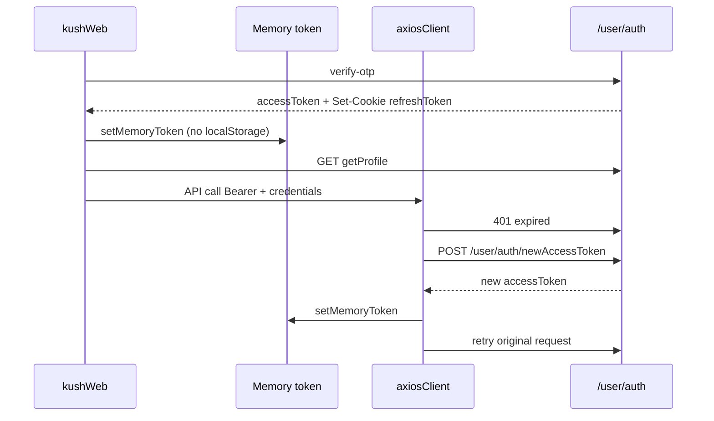

# kushWeb — Token, Refresh & Security Status

**Initial pass:** June 22, 2026  
**Re-scan:** June 22, 2026 (second pass)  
**Aligned with:** Khushadminpanel token/refresh fixes + [JWT_SECURITY_AUDIT.md](../docs/JWT_SECURITY_AUDIT.md)

---

## Executive summary

| Area | Status |
|------|--------|
| Access token in `localStorage` | **Fixed** — memory only |
| httpOnly refresh cookie + boot refresh | **OK** |
| Axios 401 silent refresh + retry | **OK** |
| Server logout on forced 401 | **OK** |
| JWT `exp` client check | **OK** |
| Profile after OTP login | **Fixed** (re-scan) — `verifyOtp` now loads profile |
| Auth-path console leaks | **Fixed** — `AuthModal` no longer logs full OTP errors |
| Console in production | **Fixed** — `isDebug()` + boot silencer + conditional `esbuild.drop` |
| CSP (Vite meta, prod only) | **Partial** — needs CDN/nginx for full coverage |
| Dependency audit (`axios`) | **Open** — high advisories; `npm audit fix` available |

---

## Architecture

---

## Grep verification matrix (re-scan)

| Check | Result |
|-------|--------|
| `localStorage` read/write for `accessToken` / `refreshToken` / `khush_access_token` in `src/` | **None** (only legacy removal in `sessionLogout.js`) |
| `dangerouslySetInnerHTML` / `innerHTML` / `eval` | **None** |
| Token via `getCurrentAccessToken()` / `useAuth()` | **OK** (`tracker.js`, `SearchPage`, sockets) |
| `withCredentials: true` on auth client | **OK** (`axiosClient`, `authSession`, `sessionLogout`) |
| Single-flight refresh | **OK** (`refreshPromise` in `axiosClient.js`) |
| `console.*` in `src/` | **Fixed** — all feature/service logs use `debugLog`; boot silencer + esbuild drop in release builds |
| `VITE_DEBUG` in user `.env` | `false` (good) |

**Intentional `localStorage`:** guest cart/wishlist, device id (`x-device-id`), analytics session/anon ids, guest review email.

---

## Issues fixed

### First pass (W1–W9)

| ID | Issue | Fix |
|----|--------|-----|
| **W1** | Access JWT in `localStorage` (XSS) | Memory-only token; legacy key cleared on boot |
| **W2** | Auth API logged tokens/OTP unconditionally | `isDebug()` + redaction in `auth.service.js` |
| **W3** | 401 handler used raw `fetch` with axios config | Proper axios interceptor + single-flight refresh |
| **W4** | Logout on 401 didn't invalidate refresh cookie | `performLogout({ server: true })` |
| **W5** | No boot-time cookie refresh | `AuthContext` calls `refreshUserAccessToken` on load |
| **W6** | Expired token treated as authenticated | `isTokenExpired` / `getValidAccessToken` |
| **W7** | `tracker.js` / `SearchPage` read localStorage token | Use `getCurrentAccessToken()` / `useAuth()` |
| **W8** | Dev server bound to `0.0.0.0` | Default `localhost`; `VITE_DEV_LAN=true` for LAN |
| **W9** | No CSP | Production CSP meta in `vite.config.js` |

### Re-scan fixes (W10–W12)

| ID | Issue | Risk | Fix |
|----|--------|------|-----|
| **W10** | `verifyOtp` set token but **did not fetch profile** | Header shows "Account" until full page reload | **Fixed** — `getProfile()` after OTP in `AuthContext.jsx` |
| **W11** | `AuthModal` `console.error` on OTP failure | Error object may leak in dev | **Fixed** — user-facing message only |
| **W12** | `services/README.md` documented localStorage token | Misleading for future devs | **Fixed** — documents memory + cookie model |

### Third pass (W13–W14)

| ID | Issue | Risk | Fix |
|----|--------|------|-----|
| **W13** | `console.*` active in prod when `VITE_DEBUG` unset but `DEV` was true in old `isDebug()` | Checkout/search noise; possible data in logs | **Fixed** — prod `isDebug()` only when `VITE_DEBUG=true`; `silenceConsoleUnlessDebug()` at boot |
| **W14** | No prod `VITE_API_URL` boot warning | Silent broken API in misconfigured deploy | **Fixed** — `warnIfProductionApiUrlMissing()` before silencer |

**Also fixed (admin):** `apiConfig.js` prod fallback was `localhost` despite warning text — now uses `https://api.khushpehno.com/api`.

---

## Layer summary

| Layer | Mechanism | Notes |
|-------|-----------|-------|
| Access token | `tokenMemory.js` | XSS can read until `exp`; not persisted |
| Refresh token | httpOnly cookie on API origin | `refreshUserAccessToken()` separate axios client |
| Boot | Cookie refresh → profile validation | Invalid profile → server logout |
| 401 | Silent refresh + retry once | Failure → `performLogout({ server: true })` |
| Socket.IO | `auth: { token }` handshake | Expected; visible in DevTools |
| Route protection | Per-page `useAuth().isAuthenticated` | No central `ProtectedRoute` — acceptable for storefront |
| Rate limits | `apiErrors.js` normalizes 429 messages | Shared pattern with admin panel |

---

## Remaining (ops / follow-up)

| Priority | Item | Notes |
|----------|------|--------|
| **Ops** | CSP at CDN/nginx | Vite meta is partial; add Razorpay, Meta, asset CDN, multi-env origins |
| **Ops** | `VITE_API_URL` required in prod CI | Boot warns if missing; set in CI |
| **Ops** | `VITE_DEBUG=false` in prod CI | Default; only enable `true` for temporary prod debugging |
| **Ops** | Google Maps API key referrer restriction | Key is bundled client-side via `VITE_GOOGLE_MAPS_API_KEY` |
| **Deps** | `npm audit` — `axios` high advisories | Run `npm audit fix` when ready to bump |
| **Low** | Meta Pixel injected whenever `VITE_META_PIXEL_ID` set | Runs in dev too if id is set |
| **Edge** | Shared `refreshToken` cookie if admin + storefront on same API host | Last login wins; separate subdomains recommended |
| **Docs** | `docs/NOTIFICATION_AND_REALTIME_INTEGRATION.md` | Still mentions localStorage for device id (accurate) but old token wording |

---

## Manual test checklist

| Test | Expected |
|------|----------|
| Login → OTP | Profile name in header immediately; no token in Application → Local Storage |
| Refresh page | Still logged in (cookie refresh) |
| Wait for token expiry / force 401 | Silent refresh; cart/profile still work |
| Logout | Cannot access profile; refresh cookie cleared |
| Guest cart | Works without token; merges after login |
| Notifications | Socket connects when `token` present |

---

## Key files

- `src/utils/tokenMemory.js`, `authToken.js`, `authSession.js`, `sessionLogout.js`, `apiErrors.js`, `deviceId.js`, `debugLog.js`
- `src/services/axiosClient.js`, `auth.service.js`
- `src/app/context/AuthContext.jsx`
- `vite.config.js`, `.env.example`

---

## Related

- [JWT_SECURITY_AUDIT.md](../docs/JWT_SECURITY_AUDIT.md)
- [Khushadminpanel/docs/TOKEN_REFRESH_ROLE_MODULE_SCAN.md](../Khushadminpanel/docs/TOKEN_REFRESH_ROLE_MODULE_SCAN.md)
